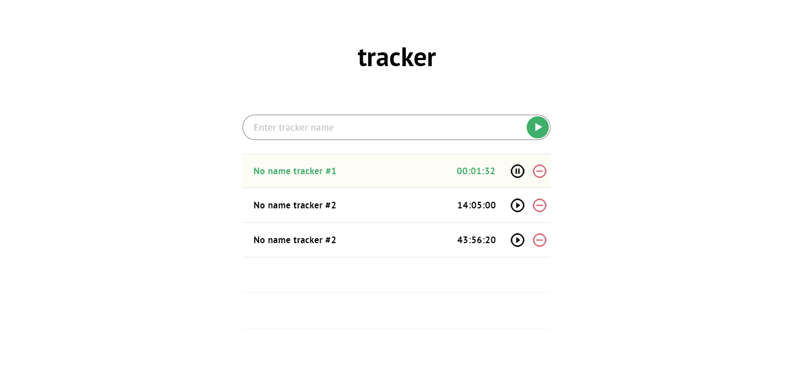

# React-Redux Time-tracker App

[View the deployed App ](https://stoic-goodall-c9b81d.netlify.app/)

Author: Vitalii Melnyk

## Technology Stack

- React with React Hooks
- React styles & libraries: Material-UI
- Redux with Redux Hooks
- Redux-persist
- Luxon.js
__________________________________________
## Nimble. Тестовое задание / Фронтенд
### Цель: создать простое одностраничное приложение для трекинга времени.

Единственный экран приложения состоит из логотипа, поля для создания новой записи
и списка уже созданных записей.

Создание записи происходит путем введения имени и нажатия кнопки ▶ или Enter.
После чего сразу же запускается таймер а запись появляется в списке ниже. Новые записи добавляются в верхнюю часть списка. Если кнопка ▶ была нажата без введения имени, то имя генерируется автоматически на основе текущей даты.

Каждый элемент списка состоит из имени, значения таймера, кнопок [пауза/старт]
и [удалить]. Запущенные трекеры выделены цветом и фоном, а их значение должно выводиться актуальным (должно обновляться с течением времени). Остановленные трекеры можно запустить снова. При запуске остановленного трекера его значение не должно обнуляться (например, если было 1:56, то должно увеличиваться дальше с этой отметки). Значение выводится в формате HH:MM:SS, кол-во часов (HH) может быть больше 24 (например, два с половиной дня будут выводиться как 60 часов).

При обновлении страницы (или закрытии/открытии браузера) должно сохраняться состояние, трекеры не должны останавливаться, время в них должно быть актуальным. Если запустить трекер, закрыть страницу и открыть ее через два часа, то у этого трекера должно быть значение 2:00:00, и оно должно продолжать увеличиваться дальше.

### Technical Requirements (Технические требования):
-	React, Redux, momentjs или его альтернативы для работы с временем;
-	возможно использование других вспомогательных инструментов или библиотек готовых компонентов кроме jquery и bootstrap;
-	для сборки использовать webpack;
-	исходный код необходимо разместить в открытом репозитории на гитхабе,
     в процессе работы делать коммиты, задеплоить работающее приложение на github pages;
-	не обязательно строго придерживаться дизайна, отступы/размеры/цвета могут отличаться, но должен быть соблюден основной лэйаут, приложение должно выглядеть эстетически приятно. Иконки можно взять тут;
-	верстка должна быть адаптивной: от 320рх до 560рх — мобильная версия
     с резиновым контейнером, 560рх и больше — десктопная с фиксированной шириной контейнера 560рх;
_____________________________________________
# Getting Started with Create React App

This project was bootstrapped with [Create React App](https://github.com/facebook/create-react-app).

## Available Scripts

In the project directory, you can run:

### `yarn start`

Runs the app in the development mode.\
Open [http://localhost:3000](http://localhost:3000) to view it in the browser.

The page will reload if you make edits.\
You will also see any lint errors in the console.

### `yarn test`

Launches the test runner in the interactive watch mode.\
See the section about [running tests](https://facebook.github.io/create-react-app/docs/running-tests) for more information.

### `yarn build`

Builds the app for production to the `build` folder.\
It correctly bundles React in production mode and optimizes the build for the best performance.

The build is minified and the filenames include the hashes.\
Your app is ready to be deployed!

See the section about [deployment](https://facebook.github.io/create-react-app/docs/deployment) for more information.

### `yarn eject`

**Note: this is a one-way operation. Once you `eject`, you can’t go back!**

If you aren’t satisfied with the build tool and configuration choices, you can `eject` at any time. This command will remove the single build dependency from your project.

Instead, it will copy all the configuration files and the transitive dependencies (webpack, Babel, ESLint, etc) right into your project so you have full control over them. All of the commands except `eject` will still work, but they will point to the copied scripts so you can tweak them. At this point you’re on your own.

You don’t have to ever use `eject`. The curated feature set is suitable for small and middle deployments, and you shouldn’t feel obligated to use this feature. However we understand that this tool wouldn’t be useful if you couldn’t customize it when you are ready for it.

## Learn More

You can learn more in the [Create React App documentation](https://facebook.github.io/create-react-app/docs/getting-started).

To learn React, check out the [React documentation](https://reactjs.org/).

### Code Splitting

This section has moved here: [https://facebook.github.io/create-react-app/docs/code-splitting](https://facebook.github.io/create-react-app/docs/code-splitting)

### Analyzing the Bundle Size

This section has moved here: [https://facebook.github.io/create-react-app/docs/analyzing-the-bundle-size](https://facebook.github.io/create-react-app/docs/analyzing-the-bundle-size)

### Making a Progressive Web App

This section has moved here: [https://facebook.github.io/create-react-app/docs/making-a-progressive-web-app](https://facebook.github.io/create-react-app/docs/making-a-progressive-web-app)

### Advanced Configuration

This section has moved here: [https://facebook.github.io/create-react-app/docs/advanced-configuration](https://facebook.github.io/create-react-app/docs/advanced-configuration)

### Deployment

This section has moved here: [https://facebook.github.io/create-react-app/docs/deployment](https://facebook.github.io/create-react-app/docs/deployment)

### `yarn build` fails to minify

This section has moved here: [https://facebook.github.io/create-react-app/docs/troubleshooting#npm-run-build-fails-to-minify](https://facebook.github.io/create-react-app/docs/troubleshooting#npm-run-build-fails-to-minify)
